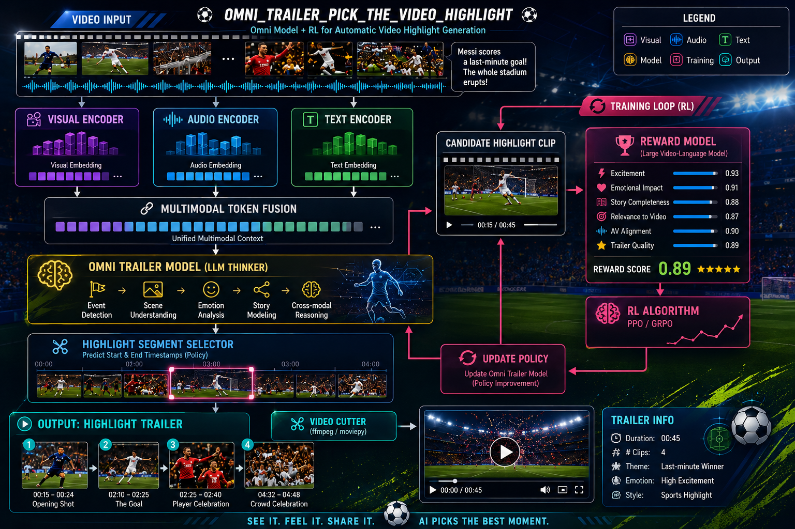
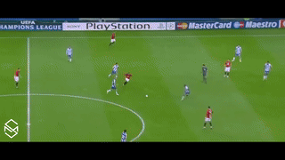

# Omni Trailer: Pick the Video Highlight

> Omni Model + RL for Automatic Video Highlight Generation

Omni Trailer is a multimodal reinforcement learning project for automatic
highlight and trailer generation.

Given a video with **visual frames**, **voice/audio**, and **captions/ASR text**,
the model learns to select the most engaging segment. Instead of relying on
human-labeled ground-truth highlights, the system uses a **reward model** to judge
generated candidate clips and trains the trailer selector through
**reinforcement learning**.

The reward model evaluates whether a candidate clip is emotionally engaging,
semantically important, visually clear, coherent as a short trailer, and aligned
with the full video context.



---

## Demo

The model watches a full clip and cuts the single most trailer-worthy moment.

| Input video (full clip) | Picked highlight (trailer) |
| :---: | :---: |
|  |  |

> The input GIF is the bundled `demo_video/Ronaldo_goal_demo.mp4`. The trailer GIF
> on the right is produced when you run inference on a GPU
> (`output/Ronaldo_goal_highlight.gif`) — it appears here after your first run.

```bash
python scripts/run_inference.py            # uses the Ronaldo demo by default
```

---

## Goal

Automatically pick the most touching, exciting, or representative highlight
section from a video, using audio, visual frames, and captions **together**.

## Pipeline

```
Video Input
    │
    ├── Visual Frames ──► Visual Encoder ──► visual embeddings
    ├── Voice / Audio ──► Audio Encoder  ──► audio embeddings
    └── Caption / ASR ──► Text Encoder   ──► text embeddings
                                  │
                                  ▼
                         Omni Fusion Model          (joint video + voice + caption)
                                  │
                                  ▼
                         Trailer Omni Model         (decides highlight start/end)
                                  │
                                  ▼
                       Candidate Highlight Clip
                                  │
                                  ▼
                            Reward Model            (large VLM/omni evaluator)
                                  │                  - emotional impact
                                  │                  - story completeness
                                  │                  - excitement
                                  │                  - relevance to full video
                                  │                  - audio-visual alignment
                                  │                  - trailer quality
                                  ▼
                   Reinforcement Learning Training  (PPO / GRPO / DPO-style)
                                  │
                                  ▼
                      Update Trailer Omni Model
                                  │
                                  ▼
                       Better Highlight Selection
```

### 1. Multimodal encoding
Each modality is encoded independently:
- **Visual Encoder** — frames → visual embeddings (e.g. CLIP/ViT/video backbone).
- **Audio Encoder** — waveform/spectrogram → audio embeddings (e.g. Whisper encoder / wav2vec).
- **Text Encoder** — captions or ASR transcript → text embeddings (tokenizer + LM).

### 2. Multimodal token fusion
The `OmniFusionModel` projects all modalities into a shared token space and
produces a **unified multimodal context** aligned along the video timeline.

### 3. Trailer Omni Model (LLM Thinker)
A reasoning module performs **event detection, scene understanding, emotion
analysis, story modeling, and cross-modal reasoning**, then a **Highlight Segment
Selector** acts as the policy that predicts the highlight **start/end
timestamps**.

### 4. Video cutting
`video_cut/` proposes candidate segments, refines boundaries, and exports the
final clip with ffmpeg/moviepy.

### 5. Reward model
A large VLM/omni model scores each candidate clip on six axes (excitement,
emotional impact, story completeness, relevance, AV alignment, trailer quality)
and returns a scalar reward.

### 6. RL training loop
The policy is optimized with **PPO / GRPO** (DPO-style preference training is
also supported) using the reward model's score as the training signal — no
ground-truth highlight labels required.

---

## Project structure

```
Omni_Trailer_Pick_the_Video_Highlight/
├── README.md
├── requirements.txt
├── configs/                # model / reward / RL hyperparameters (YAML)
├── data/                   # raw_videos, processed features, metadata
├── src/
│   ├── encoders/           # visual / audio / text encoders
│   ├── omni_model/         # fusion model, LLM thinker, trailer selector (policy)
│   ├── reward/             # reward model + scoring prompts
│   ├── rl/                 # PPO / GRPO trainers + rollout
│   ├── video_cut/          # segment proposal, boundary detection, export
│   └── utils/              # video / audio / logging helpers
├── scripts/                # preprocess, train, inference, evaluate
├── examples/               # demo video + outputs
└── docs/                   # idea, architecture, training notes
```

---

## Installation

Inference and RL training run the Qwen2.5-Omni backbone and need a GPU
(A100/H100 recommended).

```bash
git clone https://github.com/geoz-lab/Omni_Trailer_Pick_the_Video_Highlight.git
cd Omni_Trailer_Pick_the_Video_Highlight
conda env create -f environment.yml      # or: pip install -r requirements.txt
conda activate omni_trailer
# install flash-attn last, matched to your torch/CUDA:
# pip install flash-attn --no-build-isolation
```

The reward judge calls an external VLM API. Put your key in a `.env` file
(gitignored; auto-loaded by the scripts) — or just `export` it:

```bash
cp .env.example .env        # then edit .env and set GEMINI_API_KEY=...
# equivalently: export GEMINI_API_KEY=...
```

Default judge is Gemini 2.5 Flash (native video+audio). To use OpenAI instead,
set `judge.provider: openai` in `configs/reward.yaml` and provide `OPENAI_API_KEY`.

## Quick start

```bash
# Pick the highlight from the bundled demo and export clip + GIF
python scripts/run_inference.py            # -> output/Ronaldo_goal_highlight.mp4 + .gif

# ...or any video
python scripts/run_inference.py --video path/to.mp4 --output output

# Train the trailer selector with GRPO (needs a manifest of videos)
python scripts/train_rl.py --config configs/train_rl.yaml

# Score a folder of candidate clips with the judge
python scripts/evaluate_reward.py --clips output
```

## Configuration

| File                    | Purpose                                              |
| ----------------------- | ---------------------------------------------------- |
| `configs/model.yaml`    | Encoder backbones, fusion + selector hyperparameters |
| `configs/reward.yaml`   | Reward model id, scoring weights, prompt settings    |
| `configs/train_rl.yaml` | RL algorithm (PPO/GRPO), rollout, optimization       |

## Documentation

- [`docs/idea.md`](docs/idea.md) — motivation and problem framing
- [`docs/architecture.md`](docs/architecture.md) — model and data flow
- [`docs/training.md`](docs/training.md) — RL training recipe
- [`docs/sherlock.md`](docs/sherlock.md) — running on Stanford's Sherlock cluster (Slurm)

Ready-to-use Slurm jobs: [`slurm/inference.sbatch`](slurm/inference.sbatch),
[`slurm/train.sbatch`](slurm/train.sbatch).

## Status

The omni inference path (`run_inference.py`), the GRPO training loop
(`train_rl.py`), the Gemini/OpenAI reward judge, and all video/audio I/O are
implemented and meant to run on the GPU cluster. They have **not** been executed
on CPU here. Pin exact `transformers` / SDK versions and the Qwen2.5-Omni model
id for your environment before a full run. The proposal-stage encoders
(`src/encoders/`) remain optional stubs (the omni model ingests the full clip
directly).

## License

Released under the [MIT License](LICENSE).
