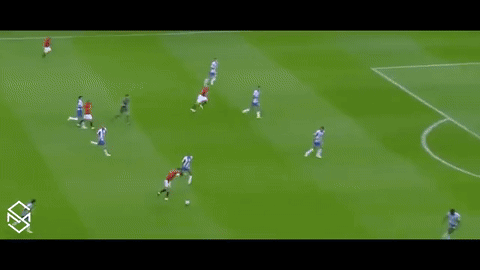

# Omni Trailer: Pick the Video Highlight

> Omni Model + RL for Automatic Video Highlight Generation

Omni Trailer is a multimodal reinforcement learning project for automatic highlight and trailer generation.

Given a video with **visual frames**, **voice/audio**, and **captions/ASR text**, the model learns to select the most engaging segment. Instead of relying on
human-labeled ground-truth highlights, the system uses a **reward model** to judge generated candidate clips and trains the trailer selector through **reinforcement learning**.

The reward model evaluates whether a candidate clip is emotionally engaging, semantically important, visually clear, coherent as a short trailer, and aligned with the full video context.

The workflow shows as below,


---

## Demo
Here we use a Ronaldo goal video as a demo to showcase the results. The model watches a full clip and cuts the single most trailer-worthy moment.

| Input video (33 s full clip) | Picked highlight (5 s trailer) |
| :---: | :---: |
|  |  |

> Real output from `scripts/run_inference.py` on the bundled
> `demo_video/Ronaldo_goal_demo.mp4`, run on one H100 (with Qwen2.5-Omni-7B as the base model). From the
> 33 s clip the model selected **2.0 s → 7.0 s** — an attacking move into a shot
> on goal with the keeper diving — and exported it as the trailer on the right.

```bash
python scripts/run_inference.py            # uses the Ronaldo demo by default
# -> output/Ronaldo_goal_demo_highlight.mp4 + .gif
```

---

## Goal

We want automatically pick the most touching, exciting, or representative highlight section from a video, using audio, visual frames, and captions **together**.

## RL Training Pipeline

```
[Video Input]
    │
    ├── Visual Frames ──► Visual Encoder ──► [visual embeddings]
    ├── Voice / Audio ──► Audio Encoder  ──► [audio embeddings]
    └── Caption / ASR ──► Text Encoder   ──► [text embeddings]
                                  │
                                  ▼
                         Omni Fusion Model          (joint video + voice + caption)
                                  │
                                  ▼
                         Trailer Omni Model         (decides highlight start/end)
                                  │
                                  ▼
                       Candidate Highlight Clip
                                  │
                                  ▼
                            Reward Model            (large VLM/omni evaluator)
                                  │                  - emotional impact
                                  │                  - story completeness
                                  │                  - excitement
                                  │                  - relevance to full video
                                  │                  - audio-visual alignment
                                  │                  - trailer quality
                                  ▼
                   Reinforcement Learning Training  (PPO / GRPO / DPO ...)
                                  │
                                  ▼
                      Update Trailer Omni Model
                                  │
                                  ▼
                       Better Highlight Selection
```

### 1. Multimodal encoding
Each modality is encoded independently:
- **Visual Encoder** — frames → visual embeddings (e.g. CLIP/ViT/video backbone).
- **Audio Encoder** — waveform/spectrogram → audio embeddings (e.g. Whisper encoder / wav2vec).
- **Text Encoder** — captions or ASR transcript → text embeddings (tokenizer + LM).

### 2. Multimodal token fusion
The `OmniFusionModel` projects all modalities into a shared token space and produces a **unified multimodal context** aligned along the video timeline.

### 3. Trailer Omni Model (LLM Thinker)
A reasoning module performs **event detection, scene understanding, emotion analysis, story modeling, and cross-modal reasoning**, then a **Highlight Segment Selector** acts as the policy that predicts the highlight **start/end timestamps**.

### 4. Video cutting
`video_cut/` proposes candidate segments, refines boundaries, and exports the final clip with ffmpeg/moviepy.

### 5. Reward model
A large VLM (using API)/omni model scores each candidate clip on six axes (excitement, emotional impact, story completeness, relevance, AV alignment, trailer quality) and returns a scalar reward.

### 6. RL training loop
The policy is optimized with **PPO / GRPO** (DPO-style preference training is also supported) using the reward model's score as the training signal — no ground-truth highlight labels required.

---

## Project structure

```
Omni_Trailer_Pick_the_Video_Highlight/
├── README.md
├── requirements.txt
├── configs/                # model / reward / RL hyperparameters (YAML)
├── data/                   # raw_videos, processed features, metadata
├── src/
│   ├── encoders/           # visual / audio / text encoders
│   ├── omni_model/         # fusion model, LLM thinker, trailer selector (policy)
│   ├── reward/             # reward model + scoring prompts
│   ├── rl/                 # PPO / GRPO trainers + rollout
│   ├── video_cut/          # segment proposal, boundary detection, export
│   └── utils/              # video / audio / logging helpers
├── scripts/                # preprocess, train, inference, evaluate
├── examples/               # demo video + outputs
└── docs/                   # idea, architecture, training notes
```

---

## Installation

Inference and RL training run the Qwen2.5-Omni backbone and need a GPU (A100/H100 recommended).

```bash
git clone https://github.com/geoz-lab/Omni_Trailer_Pick_the_Video_Highlight.git
cd Omni_Trailer_Pick_the_Video_Highlight
```

On a **modern OS (GLIBC ≥ 2.27)** the conda file just works:

```bash
conda env create -f environment.yml
conda activate omni_trailer
# optional speedup: pip install flash-attn --no-build-isolation
```

### Environment setup on an old-GLIBC HPC cluster (verified: Sherlock / CentOS 7, GLIBC 2.17)

`conda env create -f environment.yml` and a plain `pip install -r requirements.txt`
**do not work** there, because the system GCC (4.8.5) can't build native packages and conda's `pytorch-cuda` needs GLIBC ≥ 2.27. Run these from a **login node** (it has internet; compute nodes don't), in order:

```bash
# 1. base env
conda create -y -n omni_trailer python=3.11
conda activate omni_trailer

# 2. native/compiled deps from conda-forge (system GCC can't build them;
#    wandb's pip build needs Go)
conda install -y -c conda-forge av scipy librosa numba wandb

# 3. PyTorch from pip cu121 wheels (conda pytorch-cuda needs GLIBC >= 2.27;
#    torch <= 2.5 keeps manylinux2014 = GLIBC 2.17)
pip install torch==2.5.1 torchvision==0.20.1 torchaudio==2.5.1 \
    --index-url https://download.pytorch.org/whl/cu121

# 4. the rest as wheels. transformers PINNED 4.52.4: >=4.53 needs
#    torch.float8_e8m0fnu (torch>=2.7 -> GLIBC>=2.27, impossible here)
pip install "transformers==4.52.4" accelerate peft qwen-omni-utils \
    google-genai openai imageio imageio-ffmpeg moviepy opencv-python-headless

# 5. pillow from a pip wheel (bundles its own libtiff; conda pillow mismatches)
pip install --force-reinstall --no-cache-dir pillow

# 6. pre-download the model on the login node (compute nodes are offline)
export HF_HOME=$SCRATCH/hf
huggingface-cli download Qwen/Qwen2.5-Omni-7B
```

Then **on the GPU node**, before running:

```bash
conda deactivate; conda activate omni_trailer        # avoid env-stacking PATH shadowing
export HF_HOME=$SCRATCH/hf HF_HUB_OFFLINE=1 TRANSFORMERS_OFFLINE=1
export PYTORCH_CUDA_ALLOC_CONF=expandable_segments:True
export TOKENIZERS_PARALLELISM=false
```

Notes:
- `configs/model.yaml` uses `attn_implementation: sdpa` so **no flash-attn build is required**. flash-attn is faster and lower-memory if you can build it.
- The code handles two cluster-specific quirks automatically: it loads Qwen2.5-Omni text-only and neutralizes the `torch.load` guard for the trusted speaker file (see the note below), since torch ≥ 2.6 isn't installable on GLIBC 2.17.
- See [`docs/sherlock.md`](docs/sherlock.md) for Slurm jobs, the demo-video copy, and the reward-API egress caveat.

The reward judge calls an external VLM API. Put your key in a `.env` file
(gitignored; auto-loaded by the scripts) — or just `export` it:

```bash
cp .env.example .env        # then edit .env and set GEMINI_API_KEY=...
# equivalently: export GEMINI_API_KEY=...
```

Default judge is Gemini 2.5 Flash (native video+audio). To use OpenAI instead,
set `judge.provider: openai` in `configs/reward.yaml` and provide `OPENAI_API_KEY`.

## Quick start

```bash
# Pick the highlight from the bundled demo and export clip + GIF
python scripts/run_inference.py            # -> output/Ronaldo_goal_demo_highlight.mp4 + .gif

# ...or any video
python scripts/run_inference.py --video path/to.mp4 --output output

# Train the trailer selector with GRPO (needs a manifest of videos)
python scripts/train_rl.py --config configs/train_rl.yaml

# Score a folder of candidate clips with the judge
python scripts/evaluate_reward.py --clips output
```

## Preparing training data

GRPO trains on your own videos — no highlight labels needed (the reward model
scores the clips). You just need a folder of short `.mp4` files and a manifest.

**Where to put the videos**

- Locally: drop them in [`data/raw_videos/`](data/raw_videos) (gitignored, so they
  won't be committed).
- On a cluster: keep large files on `$SCRATCH` and point the manifest at absolute
  paths (e.g. `$SCRATCH/omni_trailer_data/clip01.mp4`).

**Keep clips short.** Vision attention is O(tokens²), so cost scales with
`length × resolution`. Aim for **~15 s–2 min** per clip; `configs/model.yaml`
(`frame_rate`, `video_max_pixels`) further caps tokens. Trim a long file with the
bundled ffmpeg, e.g. a 30 s cut starting at 1:05:

```bash
ffmpeg -ss 00:01:05 -i long.mp4 -t 30 -c:v libx264 -c:a aac data/raw_videos/clip01.mp4
```

**Build the manifest** `data/metadata/train.jsonl` — one JSON object per line
(`summary` gives the judge full-video context for the relevance axis):

```json
{"video": "data/raw_videos/clip01.mp4", "summary": "Champions League final, last-minute winner"}
{"video": "data/raw_videos/clip02.mp4", "summary": "Nadal vs Federer, five-set classic"}
```

### Where to get free short videos

Royalty-free / Creative-Commons stock sites — all offer direct `.mp4` downloads and short clips, free for research use (check each site's license):

| Source | Notes |
| --- | --- |
| [Pexels Videos](https://www.pexels.com/videos/) | Large library, free license, no attribution required |
| [Pixabay Videos](https://pixabay.com/videos/) | Free license, mp4 downloads |
| [Coverr](https://coverr.co/) | Short cinematic clips, free |
| [Mixkit](https://mixkit.co/free-stock-video/) | Free stock video, includes sports |
| [Videvo](https://www.videvo.net/) | Free clips (some need attribution) |
| [Internet Archive](https://archive.org/details/movies) | Public-domain footage |
| [Wikimedia Commons](https://commons.wikimedia.org/wiki/Category:Videos) | Freely licensed videos |

> ⚠️ **Licensing:** real broadcast sports highlights (e.g. actual match footage) are usually **copyrighted** — fine to experiment with on your own machine, but don't commit or redistribute them. For shareable demos, prefer the CC/stock sources above or footage you own. Tools like `yt-dlp` can fetch clips, but only use them on content you have the right to.

## Configuration

| File                    | Purpose                                              |
| ----------------------- | ---------------------------------------------------- |
| `configs/model.yaml`    | Encoder backbones, fusion + selector hyperparameters |
| `configs/reward.yaml`   | Reward model id, scoring weights, prompt settings    |
| `configs/train_rl.yaml` | RL algorithm (PPO/GRPO), rollout, optimization       |

## Documentation

- [`docs/idea.md`](docs/idea.md) — motivation and problem framing
- [`docs/architecture.md`](docs/architecture.md) — model and data flow
- [`docs/training.md`](docs/training.md) — RL training recipe
- [`docs/sherlock.md`](docs/sherlock.md) — running on Stanford's Sherlock cluster (Slurm)

Ready-to-use Slurm jobs: [`slurm/inference.sbatch`](slurm/inference.sbatch),
[`slurm/train.sbatch`](slurm/train.sbatch).

## Cluster note: torch < 2.6 + the speaker file

On GLIBC-2.17 clusters (e.g. Sherlock/CentOS 7) you're pinned to torch 2.5.x — newer CUDA wheels need GLIBC ≥ 2.27. Qwen2.5-Omni's `from_pretrained` always calls `load_speakers()`, and transformers blocks its `torch.load` on torch < 2.6 (CVE-2025-32434). `OmniThinker.load()` therefore neutralizes that guard **only** for the Qwen module, to load the **official** speaker file (`weights_only`).

This is a deliberate, scoped exception for a trusted file — don't generalize it to untrusted checkpoints. On a GLIBC ≥ 2.27 box, prefer torch ≥ 2.6 and drop the patch.

## Status

The omni inference path (`run_inference.py`), the GRPO training loop (`train_rl.py`), the Gemini/OpenAI reward judge, and all video/audio I/O are implemented and meant to run on the GPU cluster. They have **not** been executed on CPU here. Pin exact `transformers` / SDK versions and the Qwen2.5-Omni model id for your environment before a full run. The proposal-stage encoders (`src/encoders/`) remain optional stubs (the omni model ingests the full clip directly).

## License

Released under the [MIT License](LICENSE).
